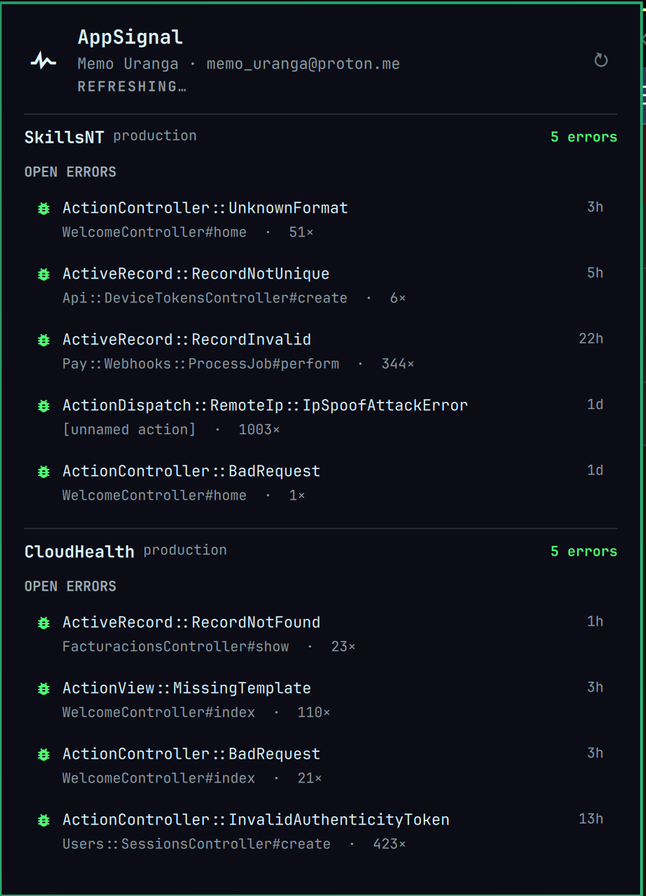
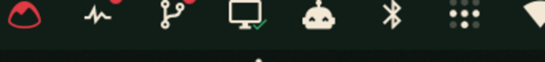

<h1 align="center">
  <br>
  󰐰 AppSignal for Omarchy
  <br>
</h1>

<p align="center">
  Your <a href="https://appsignal.com">AppSignal</a> apps, open errors and uptime monitors, one click away in the
  <a href="https://omarchy.org">Omarchy</a> bar.
</p>

<p align="center">
  <a href="LICENSE"></a>
  
  
</p>

<p align="center">
  
</p>

<p align="center">
  
</p>

## What you get

- **One icon in the bar.** A dot appears on it whenever an uptime monitor is down or an error incident is open. No numbers, no noise.
- **One panel, every app.** All the organizations and apps your token can see, apps with trouble sorted first.
- **Open errors.** The latest open exception incidents per app: exception class, action, occurrence count and age. Click one and it opens in AppSignal.
- **Uptime monitors.** Each monitor with its up/down state and, when down, since when. Click to open it.
- **Keyboard first.** `j`/`k` walk the rows, `Enter` opens, `r` refreshes, `g`/`G` jump, `Esc` closes.
- **Honest about staleness.** If AppSignal is unreachable the last good data stays on screen, marked `STALE`.
- **Nothing to build.** Bash, `curl` and `jq` collect; QML paints. Clone it and it runs.

## Install

```bash
omarchy plugin add https://github.com/memouranga/omarchy-appsignal.git --enable --yes
```

Then give it a token. Create a **personal API key** on your
[AppSignal personal settings](https://appsignal.com/users/edit) page and save it:

```bash
mkdir -p ~/.config/appsignal
echo 'YOUR-PERSONAL-API-KEY' > ~/.config/appsignal/api_token
chmod 600 ~/.config/appsignal/api_token
```

The panel picks it up on the next refresh (or right-click the icon). The token is read from, in order:
`$APPSIGNAL_API_TOKEN`, the file named by `$APPSIGNAL_TOKEN_FILE`, then `~/.config/appsignal/api_token`.
It never goes into `shell.json`.

## Use it

| Action | Result |
|---|---|
| Left click | Toggle the panel |
| Right click | Refresh now |
| `j` / `k` | Next / previous row |
| `Enter` | Open the selected incident or monitor in the browser |
| `g` / `G` | First / last row |
| `r` | Refresh now |
| `Tab` | Neighbouring bar panel |
| `Esc` | Close |

Bind it to a key in `~/.config/hypr/bindings.lua`:

```lua
o.bind("SUPER + CTRL + A", "AppSignal", "omarchy-shell memong.appsignal toggle")
```

`toggle`, `open`, `close` and `refresh` are all available over IPC.

## Remove

```bash
omarchy plugin remove memong.appsignal
rm -rf ~/.config/appsignal            # only if you want the token gone too
```

The plugin writes nothing else: its only state is `~/.local/state/omarchy/appsignal/overview.json`.

## Settings

Set them on the widget entry in `~/.config/omarchy/shell.json`:

```json
{ "id": "memong.appsignal", "refreshIntervalSec": 120, "incidentsPerApp": 5 }
```

| Key | Default | What it does |
|---|---|---|
| `refreshIntervalSec` | `120` | Seconds between collector runs (min 30) |
| `incidentsPerApp` | `5` | Open error rows shown per app |

## Requirements and trust

- **Dependencies:** `curl` and `jq`, both present on a stock Omarchy install. Nothing is compiled, installed or fetched at runtime.
- **Network:** one HTTPS request to `appsignal.com` per refresh. Your token travels only there, as the query parameter AppSignal's API requires.
- **Privileges:** runs unsandboxed inside the Omarchy shell as your user, like every plugin. It reads your token file, writes one state file, and opens URLs with `omarchy launch browser`. No `sudo`, no services, no background daemons.
- **Read only:** the token grants read access to your AppSignal account. The plugin never mutates anything there.

## How it works

```
manifest.json           declares the bar widget
bin/appsignal-collect   bash + curl + jq: one GraphQL request, writes
                        ~/.local/state/omarchy/appsignal/overview.json
Main.qml                runs the collector on a timer, watches the file
Panel.qml               the bar icon and the panel
```

The collector asks the [AppSignal GraphQL API](https://docs.appsignal.com/api/graphql) for every
organization and app, their open exception incidents and uptime monitors with alerts, in a single request.
A monitor counts as down when it carries an alert in `OPEN` or `WARMUP` state.

## Roadmap

- Performance incidents
- Check-ins (cron and heartbeat)
- Host metrics
- Last deploy per app

## Contributing

Issues and pull requests welcome. Validate before you push:

```bash
omarchy plugin validate .
```

## License

[MIT](LICENSE) © 2026 Memo Uranga
